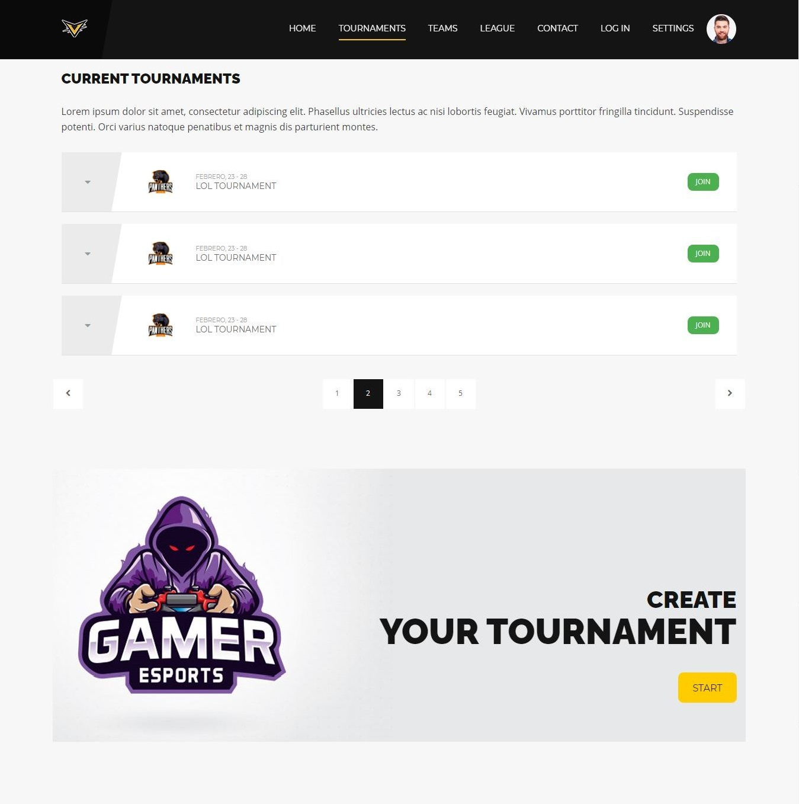
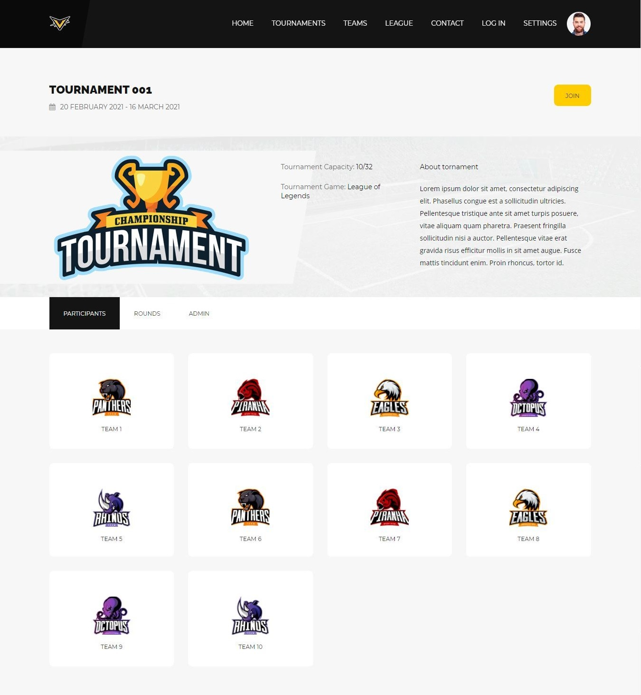

# VICTORIOUS

## Team members

| Name | Mail | Github user|
|--------|--------|------------|
|Daniel Lahera Esteban| d.lahera@alumnos.urjc.es | DaniL97 |
|Enrique Garrido Gónzalez | e.garridogon@alumnos.urjc.es | kikegg |
|Daniel Alexander Juan Moreno | da.juan@alumnos.urjc.es | dajm92 |
|Jacobo Miguel Blanzaco Barreiro  | jm.blanzaco.2016@alumnos.urjc.es | jacobobbm |

## PHASE 0

### Description

Victorious is a web app about e-sports tournaments and leagues management. You will be able to create and manage tornaments with your friends, and also watch the oficial league and tournaments with their rounds and winners.
In addition to that, you can create your own team, apply for others or simply watch the pro existing teams.

### Entities

User, Team, Tournament, Game

* **User**: They can participate in tornaments being part of a team.
* **Team**: Composed by several users. Can have multiple games.
* **Tournaments**: Composed by several teams. Associated to one game at a time.

### Users and permissions

* **Anonymous User**: read and visualization permissions over public content. 
* **Normal User**: Same anonymous user permission plus write permissions over tournaments created, write permissions over its profile data, write permissions over created team, read permissions over a team.
* **Admin User**: Registered user permissions plus read, write and remove permissions over team, user, tournament and game. 

### Images

All users have associated one image to their account same as every team. This image is default, but every player and team can modify their image by uploading one.

### Graphics

Stats graphs related with games and rounds played (wins/losses) 

### Complementary Technology

Login with third parties IDP

### Algorithm or advanced query

- Every tournament have users or teams participating in them. When the admin or the creator of the tournament proceed to start the tournament. The web aplication will automatically generate the matchups.
The web aplication will also generate new rounds with their matchups every time the admin or the creator of the tournament validates the round to advance into the next, until the tournament have a winner.
- The web application has a classification that will be updated automatically based on the official tournaments and the points achieved by the teams that participate in them. 

## PHASE 1

### Web Page Screenshots

**Home:**

Homescreen from where you land when you enter the app, it gives you a general view of everything the apps offers.

**Teams:**

This screen shows a list of all the teams managed in our database. From here also you can create a new team.

**Team:**

Shows general info about an individual team, you can see from here statistics from their games, tournaments where they are participating and you can also check its members.

**Tournaments:**

From here you can see a list of the created tournaments and if possible you can join one of them to participate. Also you can create a new tournament to be played.

**Tournament:**

From this screen you can check the information from an tournament, you can see team that are participating in, the results from the current round, and also admins can manage the tournament from an special tab where they can pass to the next round and start the tournament.

**League:**

It shows the general clasification for the games that the teams played, it will be automatically updated once the matches end.

**Login:**

Screen that checks if the user exist in the database and if the password match, grants permission to edit user, participate in tournaments,etc.

**Sign Up:**

This screen uses the data introduced to create a new user in the database.

**User**

From this screen you can see the user's information, such as their accounts or the team in which they participate

**Settings:**

Form here a user can change the user attributes: avatar, accounts, nick, email and password. This is available for every registered user.

**Contact:**

Screen that shows information about the web app in general, also it allow users to send us some feedback via short message.

### Navigation Diagram

## PHASE 2

### Web Page Screenshots

The description and usefulness of the screens on our website is still the same presented in Phase 1, but in the following screenshots we can see the evolution of the website

**Home:**

**Teams:**

As said, from here we can create a new Team:

**Team:**

With the user controll implemented, from here the administrator can change the team image, accept user requests and control them:

**Tournaments:**

As said, from here we can create a new Tournament:

**Tournament:**

**League:**

**Login:**

**Sign Up:**

**User**

**Settings:**

**Contact:**

### Navigation Diagram

The Navigation Diagram has not undergone any change and remains the same as in phase 1, because we contemplate all the pages with their relationships in a precise way.

### UML Class Diagram

### Database Diagram

### Templates Diagram

### Execution Instructions

**Prerrequisites** 
* Java JDK 11 or newer.
* MySQL 8.0 or newer.
* A Browser (Firefox, Google Chrome, Safari, Microsoft Edge...).

**Installation and Running**
* Clone this repository on your computer or get the code from the release.
* Create the database in MySQL Workbench with the name Victorious. (Credentials: User = Admin, Password = Pass)
* In your trusted enviroment, right click on the proyect to Run as Spring Boot App
* Finally you can open your selected browser to access the web application from: https://localhost:8443

## Participation

 **Member's Work**

* **Daniel Lahera Esteban**: He was in charge of creating the base of user, that means creating user, userControler, userReopsitory userService and userServiceImp, after that he added the option to sign up with google. Later he created the error page that shows when an error ocurrs in the webpage, and finally he included 4 extra attributes in team and used them to create the chart of victories and defeats and the league/ranking that updates automatically.  
* **Enrique Garrido Gónzalez**: He has taken care of the setup of the Spring Proyect, leaving the first Controller, Repository and Service created as the basis for the rest of the team. He has worked on the creation of the MySQL database, focusing mainly on the Teams, Games and User classes where he has done most of the logic. He has also been in charge of introducing and developing the security for the web, the creation of the buttons with the load more functionality and helped all of the members with their tasks.
* **Daniel Alexander Juan Moreno**:His main focus on this phase was the development of the tournament funtionalities and its coordination with other related entities such as Teams, Rounds or Matchs. He also worked on a way to make the match ups random, collaborate in the "Load More" for pages with more than 10 elements and the implementation of user control management for tournaments and finally He is the creator of the DataBase and Template Diagrams.
* **Jacobo Miguel Blanzaco Barreiro**: His main contributions were carried out in the tournaments, rounds and matches sections of the application. Additionally he was responsable for enabling user to join tournaments and the Contact Mailing System.

**Member's Important Commits**

| Name | Github user| Commit 1| Commit 2| Commit 3| Commit 4| Commit 5|
|--------|------------|-------|---------|---------|---------|---------|
|Daniel Lahera Esteban| DaniL97 | [Partial implementation of user, login...](https://github.com/CodeURJC-DAW-2020-21/webapp5/commit/ad087b43b72b16ff6b462e2328106a8292f1cf99) | [Completed google sign up](https://github.com/CodeURJC-DAW-2020-21/webapp5/commit/5c9bba6b064ac2731b65f22722bc0968f6bd3957) | [Added error page](https://github.com/CodeURJC-DAW-2020-21/webapp5/commit/f9c5e5266d9418a7f171b355fa129252c4c96630) | [Completed team stats](https://github.com/CodeURJC-DAW-2020-21/webapp5/commit/4657be099e0d79cdda93b4c6d7a8869a00f77ef7) | [Added League](https://github.com/CodeURJC-DAW-2020-21/webapp5/commit/4fcfe1e8eb333abbfdd1e8fd46a1f6b8dbeb7021)  |
|Enrique Garrido Gónzalez | kikegg | Spring Project Setup: [Spring Web Folder Structure](https://github.com/CodeURJC-DAW-2020-21/webapp5/commit/0019fb25f66ae9b5c786872d3456bb4351ece4b6) + [Header + Footer + 1st Controller](https://github.com/CodeURJC-DAW-2020-21/webapp5/commit/f9b5f9cfc11d9262fb31d602ac94728ebf0ce1e4) | [BBDD + Teams + Games](https://github.com/CodeURJC-DAW-2020-21/webapp5/commit/de10de937b49725cc73d6248ed172777646a58e0) |[Working LoadMores](https://github.com/CodeURJC-DAW-2020-21/webapp5/commit/1b72e5703a3ca8163cdef50cbad52eecac196ac1) |[Security + Improvements](https://github.com/CodeURJC-DAW-2020-21/webapp5/commit/7f152ed7066f2063263e7b02dd557a72d306e34d) |[Team-User Joint Operation](https://github.com/CodeURJC-DAW-2020-21/webapp5/commit/361ae8476eb5d8ff4eeaee29a90af5a682e1f00f) |
|Daniel Alexander Juan Moreno | dajm92 | [Tournament Logic](https://github.com/CodeURJC-DAW-2020-21/webapp5/commit/2c16825de4ef2e521c0695134ba6cd5ae379bca0) | [Round and Matches Logic](https://github.com/CodeURJC-DAW-2020-21/webapp5/commit/a51df005d1bf014aa7582509e89302c240320c15) | [Tournament advancement](https://github.com/CodeURJC-DAW-2020-21/webapp5/commit/c23fdccdb623b861f141843b9d4da66eda531cf1) | [Tournament User Control](https://github.com/CodeURJC-DAW-2020-21/webapp5/commit/a01e013d4d3666104510f4f22fe2ed251cee2dba) | Several Minor fixes |
|Jacobo Miguel Blanzaco Barreiro  | jacobobbm |[Contact Mail System](https://github.com/CodeURJC-DAW-2020-21/webapp5/commit/cd35e8ad8de8f00a3ddb17ec168d42027da1237e)|[Join Tournament](https://github.com/CodeURJC-DAW-2020-21/webapp5/commit/ccb7e9324da9917324fbb163f8e5cd3e59c82d48) | [Round and Matches addition](https://github.com/CodeURJC-DAW-2020-21/webapp5/commit/a51df005d1bf014aa7582509e89302c240320c15) | UML Class Diagram | Other fixes |

**Member's Most Focused Files**
| Name | Github user| File 1| File 2| File 3| File 4| File 5|
|--------|------------|-------|---------|---------|---------|---------|
|Daniel Lahera Esteban| DaniL97 | [User](https://github.com/CodeURJC-DAW-2020-21/webapp5/blob/fase2/victorious_web/src/main/java/com/victorious/user/User.java) | [UserController](https://github.com/CodeURJC-DAW-2020-21/webapp5/blob/fase2/victorious_web/src/main/java/com/victorious/user/UserController.java) | [UserServiceImp](https://github.com/CodeURJC-DAW-2020-21/webapp5/blob/fase2/victorious_web/src/main/java/com/victorious/user/UserServiceImp.java) | [league.html](https://github.com/CodeURJC-DAW-2020-21/webapp5/blob/fase2/victorious_web/src/main/resources/templates/league.html) | [error](https://github.com/CodeURJC-DAW-2020-21/webapp5/blob/fase2/victorious_web/src/main/resources/static/css/error.css) |
|Enrique Garrido Gónzalez | kikegg | [Data Base Initializer](https://github.com/CodeURJC-DAW-2020-21/webapp5/blob/main/victorious_web/src/main/java/com/victorious/DataBaseInitializer.java)| [Team Controller](https://github.com/CodeURJC-DAW-2020-21/webapp5/blob/main/victorious_web/src/main/java/com/victorious/team/TeamController.java) | [Team Java](https://github.com/CodeURJC-DAW-2020-21/webapp5/blob/main/victorious_web/src/main/java/com/victorious/team/Team.java) | [Team Load More](https://github.com/CodeURJC-DAW-2020-21/webapp5/blob/main/victorious_web/src/main/resources/static/js-backend/loadMoreTeams.js) + [Tournament Load More](https://github.com/CodeURJC-DAW-2020-21/webapp5/blob/main/victorious_web/src/main/resources/static/js-backend/loadMoreTournaments.js) | Security: [CSRFHandlerConfiguration](https://github.com/CodeURJC-DAW-2020-21/webapp5/blob/main/victorious_web/src/main/java/com/victorious/security/CSRFHandlerConfiguration.java) + [RepositoryUserDetails](https://github.com/CodeURJC-DAW-2020-21/webapp5/blob/main/victorious_web/src/main/java/com/victorious/security/RepositoryUserDetailsService.java) + [SecurityConfiguration](https://github.com/CodeURJC-DAW-2020-21/webapp5/blob/main/victorious_web/src/main/java/com/victorious/security/SecurityConfiguration.java) |
|Daniel Alexander Juan Moreno | dajm92 | [TournamentController](https://github.com/CodeURJC-DAW-2020-21/webapp5/blob/main/victorious_web/src/main/java/com/victorious/tournament/TournamentController.java) | [tournament.html](https://github.com/CodeURJC-DAW-2020-21/webapp5/blob/main/victorious_web/src/main/resources/templates/tournament.html) | [Rounds](https://github.com/CodeURJC-DAW-2020-21/webapp5/blob/main/victorious_web/src/main/java/com/victorious/tournament/Rounds.java) | [Tournament](https://github.com/CodeURJC-DAW-2020-21/webapp5/blob/main/victorious_web/src/main/java/com/victorious/tournament/Tournament.java) | [MatchUp](https://github.com/CodeURJC-DAW-2020-21/webapp5/blob/main/victorious_web/src/main/java/com/victorious/tournament/MatchUp.java) |
|Jacobo Miguel Blanzaco Barreiro  | jacobobbm |[TournamentController](https://github.com/CodeURJC-DAW-2020-21/webapp5/blob/main/victorious_web/src/main/java/com/victorious/tournament/TournamentController.java)|[TournamentServiceImp](https://github.com/CodeURJC-DAW-2020-21/webapp5/blob/main/victorious_web/src/main/java/com/victorious/tournament/TournamentServiceImp.java) | [RoundController](https://github.com/CodeURJC-DAW-2020-21/webapp5/blob/main/victorious_web/src/main/java/com/victorious/tournament/Roundcontroller.java) | [tournaments.html](https://github.com/CodeURJC-DAW-2020-21/webapp5/blob/main/victorious_web/src/main/resources/templates/tournaments.html) | [tournament.html](https://github.com/CodeURJC-DAW-2020-21/webapp5/blob/main/victorious_web/src/main/resources/templates/tournament.html) |

## PHASE 3

**API Rest Documentation**

[YAML File](api_docs/api-docs.yaml)

[API Rest Documentation](https://ghcdn.rawgit.org/CodeURJC-DAW-2020-21/webapp5/fase3/api_docs/api-docs.html)

**Class Diagram update**

For simplicity we ommitted certain elements of the diagram to make it understandable:
* Tournament: it also have other entities such as Round and Matchup with a similar structure like the other entities but without conotroller or restController
* Entity controllers: some relations have been ommited for a better readability
    * TournamentController: also uses services from game match, round, team and user
    * TeamController: also uses services form game and user

**Instructions to execute the docker app**

Local prerrequisites:

* Windows: Docker Desktop 2.0+ on Windows 10 Pro/Enterprise. Windows 10 Home (2004+) requires Docker Desktop 2.2+ and the WSL2 back-end (Docker Toolbox is not supported)
* macOS: Docker Desktop 2.0+
* Linux: Docker CE/EE 18.06+ and Docker Compose 1.21+

Once Docker is installed:

* Build a "docker-compose.yaml", to run the webapp with a mysql database within the same container, such as [this one](ENLACE DEL YAML DEL COMPOSE)
    * Note that the webapp must be published in dockerhub for this to work properly
* Open a terminal in the same location you have the "docker-compose.yml" and execute the command "docker-compose up"
* Wait for the images to download if you don't have them yet, and then wait for the application to finish its set-up. Once is finished it can be used as intended

**Documentation to build the docker image**

Development environnmet set-up:
* Java JDK 11
* Docker:
    * Windows: Docker Desktop 2.0+ on Windows 10 Pro/Enterprise. Windows 10 Home (2004+) requires Docker Desktop 2.2+ and the WSL2 back-end (Docker Toolbox is not supported)
    * macOS: Docker Desktop 2.0+
    * Linux: Docker CE/EE 18.06+ and Docker Compose 1.21+
* IDE (visual studio code or srping tool suite recommended)
* Maven extension (lifecycle) for that IDE

## Participation

 **Member's Work**

* **Daniel Lahera Esteban**: He has contributed to User, Team, and Tournament. He created User Rest Controller and Login Controller along with Enrique and during the phase 3 updated User Rest Controllers various times. He was also in charge of creating Team Rest Controller and fixing it later, finally he helped Enrique Create and mantain Tournament Rest Controller. Even though he has contributed to 3 entities, his main focus has been in Team and in second place User, besides that he was the one who managed the interfaces to avoid infinite request in postman.
* **Enrique Garrido Gónzalez**: He has taken care of leaving the first RestController functions and Basic Interfaces so the rest of the team could get an idea of how the work with the APIs was going to be. He was also in charge of all the security part of the phase. Furthermore he has also worked in all the rest controllers, both on his own account, and helping others in the User Rest Controller, in the Team Rest Controller, in the Tournament Rest Controller and in the implementation of the ImageService. Without neglecting the contribution of the postman collection and the work of the api docs 
* **Daniel Alexander Juan Moreno**: He managed and create all the logic and services related to the docker deployment, from the cration of the dockerfile and the docker-compose.yml to the creation of the team dockerhub account and the building of the webapp image, also colaborates to the correction of the UML Class Diagram to make it more readable and the creation of the api-doc.
* **Jacobo Miguel Blanzaco Barreiro**: He was focused on the TournamentRestController which is one of the biggest ones

**Member's Important Commits**

| Name | Github user| Commit 1| Commit 2| Commit 3| Commit 4| Commit 5|
|--------|------------|-------|---------|---------|---------|---------|
|Daniel Lahera Esteban| DaniL97 | [Updated TeamRestController](https://github.com/CodeURJC-DAW-2020-21/webapp5/commit/4f097d57305b0eabb53ac7d5de3e1a9d3931f4cc) | [Users Rest](https://github.com/CodeURJC-DAW-2020-21/webapp5/commit/6102dc6eb7b42d6e5c2c4c4fbb7b6f9d4f62f463) | [TournamentRestController Updated](https://github.com/CodeURJC-DAW-2020-21/webapp5/commit/7f3907d302dfbe8a1f5bd42bed5e01b63f75051f) | [Patch](https://github.com/CodeURJC-DAW-2020-21/webapp5/commit/66ac81e2b790090471a7e187b99f99836274ec52) | [Fixes + Postman Collection + api-docs](https://github.com/CodeURJC-DAW-2020-21/webapp5/commit/2ece70c9ccb0ea3050ae3f58cfc961f43179defb)  |
|Enrique Garrido Gónzalez | kikegg | [Security Rest](https://github.com/CodeURJC-DAW-2020-21/webapp5/commit/89d0ee40b6600ff25a3a2e2fe19cdfc0529d4f7a) | [TournamentRestController Updated](https://github.com/CodeURJC-DAW-2020-21/webapp5/commit/7f3907d302dfbe8a1f5bd42bed5e01b63f75051f) | [User Rest](https://github.com/CodeURJC-DAW-2020-21/webapp5/commit/7bcf3f3dd3ce79519567e16b953de1671bc7a1ae) | [ImageService Rest User Team](https://github.com/CodeURJC-DAW-2020-21/webapp5/commit/7bcf3f3dd3ce79519567e16b953de1671bc7a1ae) | [Fixes + Postman Collection + api-docs](https://github.com/CodeURJC-DAW-2020-21/webapp5/commit/2ece70c9ccb0ea3050ae3f58cfc961f43179defb) |
|Daniel Alexander Juan Moreno | dajm92 | [Docker logic](https://github.com/CodeURJC-DAW-2020-21/webapp5/commit/4e9297c58dc2a329a91c6de29e246511e6d86cfb) | [api-docs](https://github.com/CodeURJC-DAW-2020-21/webapp5/commit/2ece70c9ccb0ea3050ae3f58cfc961f43179defb) |  |  |  |
|Jacobo Miguel Blanzaco Barreiro  | jacobobbm | [TournamentRestController + JsonView Annotations](https://github.com/CodeURJC-DAW-2020-21/webapp5/commit/f5e7eecb0770b8cf9b69939d5452909e3b9c6936) | [Tournament Rest Controller v0](https://github.com/CodeURJC-DAW-2020-21/webapp5/commit/00f40fa9efb780973bae54ce9956234672c38f94) |  |  |  |

**Member's Most Focused Files**
| Name | Github user| File 1| File 2| File 3| File 4| File 5|
|--------|------------|-------|---------|---------|---------|---------|
|Daniel Lahera Esteban| DaniL97 | [TournamentRestController](https://github.com/CodeURJC-DAW-2020-21/webapp5/blob/fase3/victorious_web/src/main/java/com/victorious/tournament/TournamentRestController.java) | [TeamRestController](https://github.com/CodeURJC-DAW-2020-21/webapp5/blob/fase3/victorious_web/src/main/java/com/victorious/team/TeamRestController.java) | [UserRestController](https://github.com/CodeURJC-DAW-2020-21/webapp5/blob/fase3/victorious_web/src/main/java/com/victorious/user/UserRestController.java) | [LoginController](https://github.com/CodeURJC-DAW-2020-21/webapp5/blob/fase3/victorious_web/src/main/java/com/victorious/user/auth/LoginController.java) | [Tournament](https://github.com/CodeURJC-DAW-2020-21/webapp5/blob/fase3/victorious_web/src/main/java/com/victorious/tournament/Tournament.java)  |
|Enrique Garrido Gónzalez | kikegg | [TournamentRestController](https://github.com/CodeURJC-DAW-2020-21/webapp5/blob/fase3/victorious_web/src/main/java/com/victorious/tournament/TournamentRestController.java) | [Image Service](https://github.com/CodeURJC-DAW-2020-21/webapp5/blob/fase3/victorious_web/src/main/java/com/victorious/ImageService.java) | [Security Configuration](https://github.com/CodeURJC-DAW-2020-21/webapp5/blob/fase3/victorious_web/src/main/java/com/victorious/security/RestSecurityConfig.java) | [UserRestController](https://github.com/CodeURJC-DAW-2020-21/webapp5/blob/fase3/victorious_web/src/main/java/com/victorious/user/UserRestController.java) | [Victorious.postman_collection](https://github.com/CodeURJC-DAW-2020-21/webapp5/blob/fase3/Victorious.postman_collection.json) |
|Daniel Alexander Juan Moreno | dajm92 | [Dockerfile](https://github.com/CodeURJC-DAW-2020-21/webapp5/blob/fase3/docker/Dockerfile) | [Docker-compose](https://github.com/CodeURJC-DAW-2020-21/webapp5/blob/fase3/docker/docker-compose.yml) | [Docker building script](https://github.com/CodeURJC-DAW-2020-21/webapp5/blob/fase3/docker/create_image.ps1) |  |  |
|Jacobo Miguel Blanzaco Barreiro  | jacobobbm | [TournamentRestController](https://github.com/CodeURJC-DAW-2020-21/webapp5/blob/fase3/victorious_web/src/main/java/com/victorious/tournament/TournamentRestController.java) |  |  |  |  |
