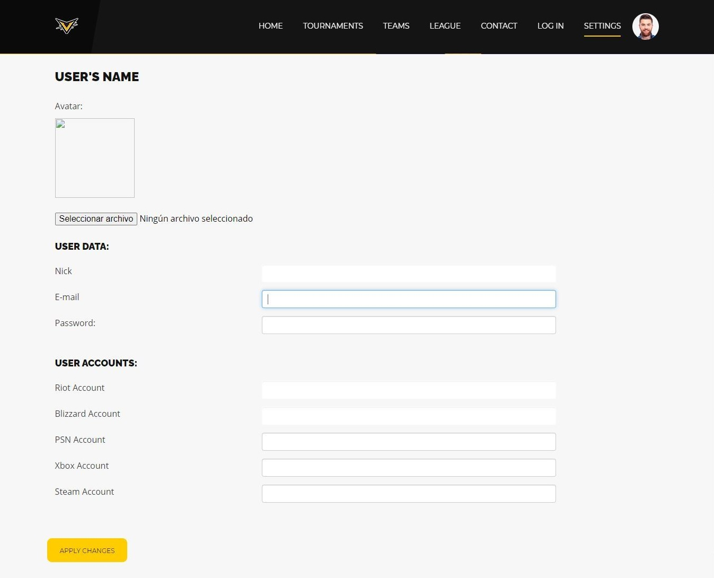

# VICTORIOUS

## Team members

| Name | Mail | Github user|
|--------|--------|------------|
|Daniel Lahera Esteban| d.lahera@alumnos.urjc.es | DaniL97 |
|Enrique Garrido Gónzalez | e.garridogon@alumnos.urjc.es | kikegg |
|Daniel Alexander Juan Moreno | da.juan@alumnos.urjc.es | dajm92 |
|Jacobo Miguel Blanzaco Barreiro  | jm.blanzaco.2016@alumnos.urjc.es | jacobobbm |

## PHASE 0

### Description

Victorious is a web app about e-sports tournaments and leagues management. You will be able to create and manage tornaments with your friends, and also watch the oficial league and tournaments with their rounds and winners.
In addition to that, you can create your own team, apply for others or simply watch the pro existing teams.

### Entities

User, Team, Tournament, Game

* **User**: They can participate in tornaments being part of a team.
* **Team**: Composed by several users. Can have multiple games.
* **Tournaments**: Composed by several teams. Associated to one game at a time.

### Users and permissions

* **Anonymous User**: read and visualization permissions over public content. 
* **Normal User**: Same anonymous user permission plus write permissions over tournaments created, write permissions over its profile data, write permissions over created team, read permissions over a team.
* **Admin User**: Registered user permissions plus read, write and remove permissions over team, user, tournament and game. 

### Images

All users have associated one image to their account same as every team. This image is default, but every player and team can modify their image by uploading one.

### Graphics

Stats graphs related with games and rounds played (wins/losses) 

### Complementary Technology

Login with third parties IDP

### Algorithm or advanced query

- Every tournament have users or teams participating in them. When the admin or the creator of the tournament proceed to start the tournament. The web aplication will automatically generate the matchups.
The web aplication will also generate new rounds with their matchups every time the admin or the creator of the tournament validates the round to advance into the next, until the tournament have a winner.
- The web application has a classification that will be updated automatically based on the official tournaments and the points achieved by the teams that participate in them. 

## PHASE 1

### Web Page Screenshots

**Home:**

Homescreen from where you land when you enter the app, it gives you a general view of everything the apps offers.

**Teams:**

This screen shows a list of all the teams managed in our database. From here also you can create a new team.

**Team:**

Shows general info about an individual team, you can see from here statistics from their games, tournaments where they are participating and you can also check its members.

**Tournaments:**

From here you can see a list of the created tournaments and if possible you can join one of them to participate. Also you can create a new tournament to be played.

**Tournament:**

From this screen you can check the information from an tournament, you can see team that are participating in, the results from the current round, and also admins can manage the tournament from an special tab where they can pass to the next round and start the tournament.

**League:**

It shows the general clasification for the games that the teams played, it will be automatically updated once the matches end.

**Login:**

Screen that checks if the user exist in the database and if the password match, grants permission to edit user, participate in tournaments,etc.

**Sign Up:**

This screen uses the data introduced to create a new user in the database.

**User**

From this screen you can see the user's information, such as their accounts or the team in which they participate

**Settings:**

Form here a user can change the user attributes: avatar, accounts, nick, email and password. This is available for every registered user.

**Contact:**

Screen that shows information about the web app in general, also it allow users to send us some feedback via short message.

### Navigation Diagram

## PHASE 2

### Web Page Screenshots

The description and usefulness of the screens on our website is still the same presented in Phase 1, but in the following screenshots we can see the evolution of the website

**Home:**

**Teams:**

As said, from here we can create a new Team:

**Team:**

With the user controll implemented, from here the administrator can change the team image, accept user requests and control them:

**Tournaments:**

As said, from here we can create a new Tournament:

**Tournament:**

**League:**

**Login:**

**Sign Up:**

**User**

**Settings:**

**Contact:**

### Navigation Diagram

The Navigation Diagram has not undergone any change and remains the same as in phase 1, because we contemplate all the pages with their relationships in a precise way.

### Database Diagram

### Important Commits by team member

| Name | Github user| Commit 1| Commit 2| Commit 3| Commit 4| Commit 5|
|--------|------------|-------|---------|---------|---------|---------|
|Daniel Lahera Esteban| DaniL97 | [Partial implementation of user, login...](https://github.com/CodeURJC-DAW-2020-21/webapp5/commit/ad087b43b72b16ff6b462e2328106a8292f1cf99) | [Completed google sign up](https://github.com/CodeURJC-DAW-2020-21/webapp5/commit/5c9bba6b064ac2731b65f22722bc0968f6bd3957) | [Added error page](https://github.com/CodeURJC-DAW-2020-21/webapp5/commit/f9c5e5266d9418a7f171b355fa129252c4c96630) | [Completed team stats](https://github.com/CodeURJC-DAW-2020-21/webapp5/commit/4657be099e0d79cdda93b4c6d7a8869a00f77ef7) | [Added League](https://github.com/CodeURJC-DAW-2020-21/webapp5/commit/4fcfe1e8eb333abbfdd1e8fd46a1f6b8dbeb7021)  |
|Enrique Garrido Gónzalez | kikegg | Spring Project Setup: [Spring Web Folder Structure](https://github.com/CodeURJC-DAW-2020-21/webapp5/commit/0019fb25f66ae9b5c786872d3456bb4351ece4b6) + [Header + Footer + 1st Controller](https://github.com/CodeURJC-DAW-2020-21/webapp5/commit/f9b5f9cfc11d9262fb31d602ac94728ebf0ce1e4) | [BBDD + Teams + Games](https://github.com/CodeURJC-DAW-2020-21/webapp5/commit/de10de937b49725cc73d6248ed172777646a58e0) |[Working LoadMores](https://github.com/CodeURJC-DAW-2020-21/webapp5/commit/1b72e5703a3ca8163cdef50cbad52eecac196ac1) |[Security + Improvements](https://github.com/CodeURJC-DAW-2020-21/webapp5/commit/7f152ed7066f2063263e7b02dd557a72d306e34d) |[Team-User Joint Operation](https://github.com/CodeURJC-DAW-2020-21/webapp5/commit/361ae8476eb5d8ff4eeaee29a90af5a682e1f00f) |
|Daniel Alexander Juan Moreno | dajm92 | [Tournament Logic](https://github.com/CodeURJC-DAW-2020-21/webapp5/commit/2c16825de4ef2e521c0695134ba6cd5ae379bca0) | [Round and Matches Logic](https://github.com/CodeURJC-DAW-2020-21/webapp5/commit/a51df005d1bf014aa7582509e89302c240320c15) | [Tournament advancement](https://github.com/CodeURJC-DAW-2020-21/webapp5/commit/c23fdccdb623b861f141843b9d4da66eda531cf1) | [Tournament User Control](https://github.com/CodeURJC-DAW-2020-21/webapp5/commit/a01e013d4d3666104510f4f22fe2ed251cee2dba) | Several Minor fixes |
|Jacobo Miguel Blanzaco Barreiro  | jacobobbm |
